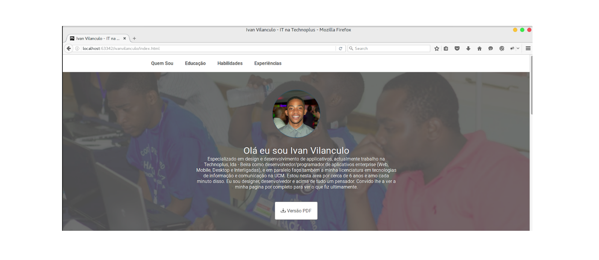

#COW personal website Template

É um template (de uma unica pagina) simples e responsivo para websites pessoais, para singulares, autores, programadores e blogueiros

##Demo
http://isneezy.github.io



##Instalção
Precione o butão "Fork" no canto superior direito para
criar copia desse template na sua conta do
github, renomeie para seunome.github.io e depois
visite https://seunome.github.io com seu navegador e
  veras o seu site novo criado

##Costumização & Densevolvimento local
Apos o seu site estiver criado pode directamente editar o ficheiro index.html
e substituir a informação la contida e pela sua. Mas para o melhor controle
aconselhamos a usar o ficheiro data.json e seguir os passos abaixo.

COW personal website template tambem vem com a opção de
definires o esquema de corres do seu website pessoal
editando o ficheiro _variables.scss contido na pasta scss.
Com isso podes mudar a cor primaria do tema simplesmente
substituindo o valor hexadecimal da variavel $color-primary com
uma a sua escolha.

###Pre requisitos

- NPM
- Bower https://bower.io/
- Gulp

###Passos

1. Clone a sua copia de COW Personal website template
    ``git clone https://github.com/yourusername/yourusername.github.io.git nomedoprejecto``


2. Na linha de comandos
    ```sh
    $ cd directorio/do/projecto
    $ npm install
    $ bower install
    ```
    Faça as alterações necessarias e na lina de comandos novamente digite
     ``$ gulp``  para costruir o website com as novas alterações.

##Creditos
* [Flaticon](http://www.flaticon.com/) Obrigado aos seus criadores colaboradores.


##Contribuindo
* Encontrou uma falha? Reporta no [Issues](https://github.com/codeonweekends/personal-website-template/issues) do GitHub
e sempre que possive seje bem detalhado.
* [Forka](https://github.com/codeonweekends/personal-website-template/fork)
 o repositorio e comesse o seu proprio site e me informe, assim poedmos incluir aqui.
 Provavelmente seje a melhor forma de contribuir
* Se encontrar algo de errado ou quer conversar conosco sobre qualquer coisa relacionada
a este template/tema ou quer contribuir, por favor fique a vontade e envie
[email para nos](contact@codeonweekends.com)

##Licenca
Esse tema esta licenciado sobre MIT


